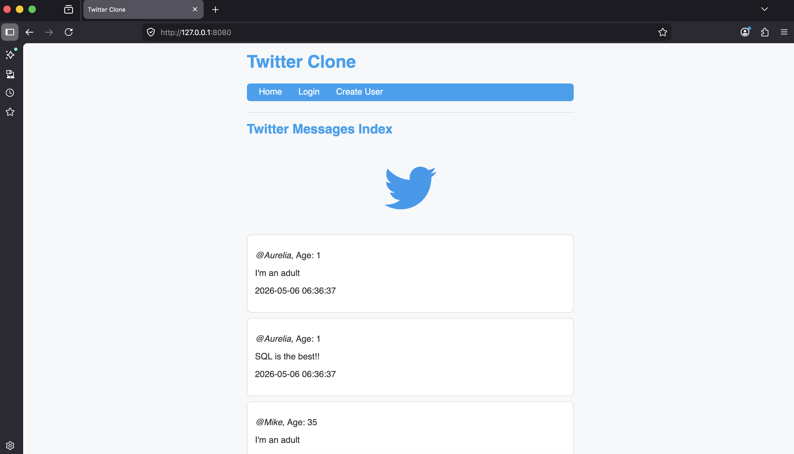

# Twitter Clone 

This project is a simple Twitter clone built with FastAPI, Jinja2 templates, SQLite.

The webpage allows users to view messages from a database, log in using query parameters, log out by clearing cookies, and create users and messages.

## Project Description

The Twitter Clone starts a local FastAPI web server and renders HTML pages using Jinja2 templates. It connects to a SQLite database called `twitter_clone.db` and displays messages joined with user information.

The homepage shows a feed of messages ordered from newest to oldest.

The app also uses cookies to remember whether a user is logged in.